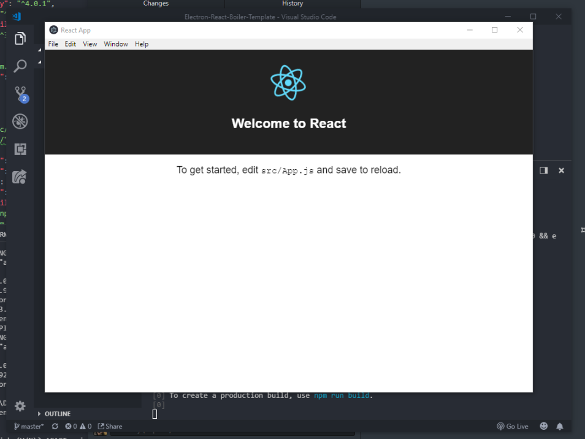

# Electron-React-Boiler-Template

## Developer

### Usage

Run `npm install` after cloning the repo.

### Testing and building projects

npm scirpts

```JSON
"scripts": {
  "react-start": "react-scripts start",
  "react-build": "react-scripts build",
  "react-test": "react-scripts test --env=jsdom",
  "react-eject": "react-scripts eject",
  "electron-build": "electron-builder",
  "release": "npm run react-build && electron-builder --publish=always",
  "build": "npm run react-build && npm run electron-build",
  "start": "concurrently \"cross-env BROWSER=none npm run react-start\" \"wait-on http://localhost:3000 && electron .\""
}
```

> `npm start` Starts react dev server and electron.

> `npm run build` Builds react project on 'build' directory and builds electron packages on 'dist' directory. (Building the react project first is necessary to build the electron packages)

---


